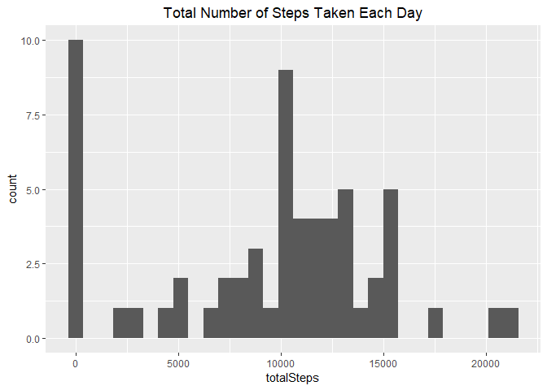
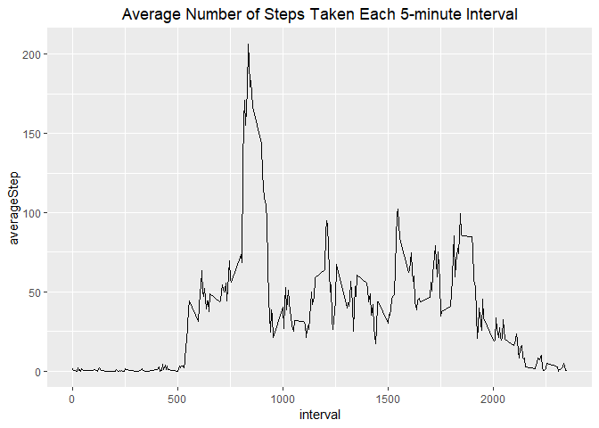
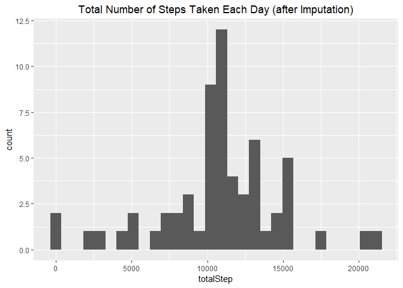
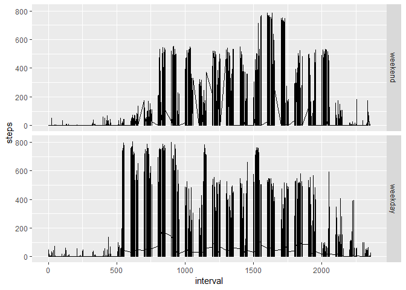

## Load package and set default options

```r
library(tidyverse)
theme_update(plot.title = element_text(hjust = 0.5))
```


## Loading and preprocessing the data


```r
unzip("activity.zip")
myData <- read.csv("activity.csv", stringsAsFactors = FALSE,
                   colClasses = c("integer", "Date", "integer"))
```

## What is mean total number of steps taken per day?

1.Calculate the total number of steps taken per day


```r
stepPerDay <- myData %>% 
  group_by(date) %>% 
  summarize(totalSteps = sum(steps, na.rm = TRUE))
```

2. Make a histogram of the total number of steps taken each day


```r
ggplot(stepPerDay, aes(x = totalSteps)) +
  geom_histogram() +
  ggtitle("Total Number of Steps Taken Each Day")
```

```
## `stat_bin()` using `bins = 30`. Pick better value with `binwidth`.
```

<!-- -->

3. Calculate and report the mean and median of the total number of steps taken perday


```r
meanStep <- mean(stepPerDay$totalSteps)
medianStep <- median(stepPerDay$totalSteps)
```

**Report:**  
The **mean** of the total number of steps taken perday is 9354.2295082.  
The **median** of the total number of steps taken perday is 10395.

## What is the average daily activity pattern?

1. Make a time series plot (i.e. type = "l") of the 5-minute interval (x-axis) and the average number of steps taken, averaged across all days (y-axis)


```r
# Calculate average steps taken by per 5-minute interval

stepPerInterval <- myData %>% 
  group_by(interval) %>% 
  summarize(averageStep = mean(steps, na.rm = TRUE))

# Draw time series plot
ggplot(stepPerInterval, aes(x = interval, y = averageStep)) +
  geom_line() + 
  ggtitle("Average Number of Steps Taken Each 5-minute Interval")
```

<!-- -->

2. Which 5-minute interval, on average across all the days in the dataset, contains the maximum number of steps?


```r
maxInterval <- stepPerInterval$interval[which.max(stepPerInterval$averageStep)]
```

**Report:**  
5-minute interval 835 on average across all the days in the dataset, contains the maximum number of steps.

## Imputing missing values

1. Calculate and report the total number of missing values in the dataset (i.e. the total number of rows with _NAs_)


```r
nRowNA <- sum(!complete.cases(myData))
```

**Report:**  
The total number of missing values in the data set is 2304

2. Devise a strategy for filling in all of the missing values in the dataset. The strategy does not need to be sophisticated. For example, you could use the mean/median for that day, or the mean for that 5-minute interval, etc.

**Strategy for imputation**: Using the mean for 5-minute interval to fill in the missing values.

3. Create a new dataset that is equal to the original dataset but with the missing data filled in.

```r
myDataFilled <- myData %>% 
  filter(is.na(steps)) %>% 
  left_join(stepPerInterval, by = "interval") %>% 
  select(steps = "averageStep", date, interval) %>% 
  rbind.data.frame(na.omit(myData)) %>% 
  arrange(date, interval)
```

4. Make a histogram of the total number of steps taken each day and Calculate and report the mean and median total number of steps taken per day. Do these values differ from the estimates from the first part of the assignment? What is the impact of imputing missing data on the estimates of the total daily number of steps?


```r
# Calculate total number of steps taken each day
stepPerDayFilled <- myDataFilled %>% 
  group_by(date) %>% 
  summarize(totalStep = sum(steps))

# Draw histogram
ggplot(stepPerDayFilled, aes(x = totalStep)) +
  geom_histogram() +
  ggtitle("Total Number of Steps Taken Each Day (after Imputation)")
```

```
## `stat_bin()` using `bins = 30`. Pick better value with `binwidth`.
```

<!-- -->


```r
# Calculate mean and median total number of steps taken per day
meanStepFilled <- mean(stepPerDayFilled$totalStep)
medianStepFilled <- median(stepPerDayFilled$totalStep)
```

**Report:**  
The **mean** of the total number of steps taken perday is 10766.19.  
The **median** of the total number of steps taken per10766.19illed)`.  
Imputation with _average steps taken each 5-interval_ cause 2 main changes on the histogram of the total daily number of steps, comparing with that in _part 1_:

1. The frequency of 0 steps for one day significantly decreased.
2. The frequency of steps number among _10000~10250_ was changed.

## Are there differences in activity patterns between weekdays and weekends?

1. Create a new factor variable in the dataset with two levels <U+9225><U+FFFD> <U+9225><U+6E28>eekday<U+9225><U+FFFD> and <U+9225><U+6E28>eekend<U+9225><U+FFFD> indicating whether a given date is a weekday or weekend day.


```r
weekdays <- c('Monday', 'Tuesday', 'Wednesday', 'Thursday', 'Friday')

myDataFilled$weekdays <- factor((weekdays(myDataFilled$date) %in% weekdays), 
         levels = c(FALSE, TRUE), labels = c('weekend', 'weekday'))
```

2. Make a panel plot containing a time series plot (i.e. type = "l") of the 5-minute interval (x-axis) and the average number of steps taken, averaged across all weekday days or weekend days (y-axis). 


```r
stepPerIntFilled <- myDataFilled %>% 
  group_by(interval, weekdays) %>% 
  summarize(averageStep = mean(steps))
ggplot(myDataFilled, aes(x = interval, y = steps)) +
  geom_line() + 
  facet_grid(weekdays~.)
```

<!-- -->

